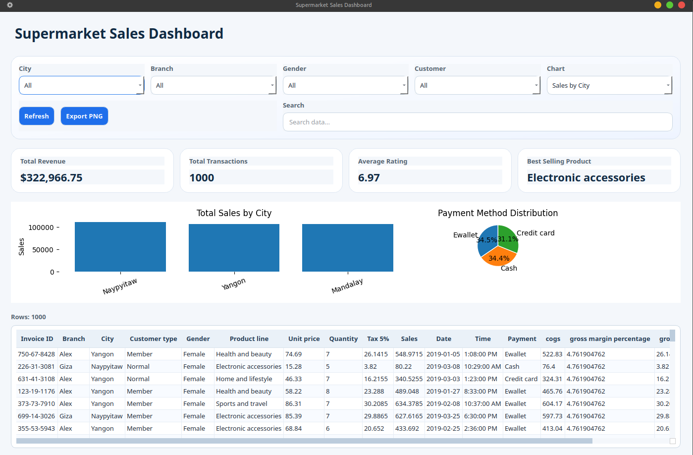
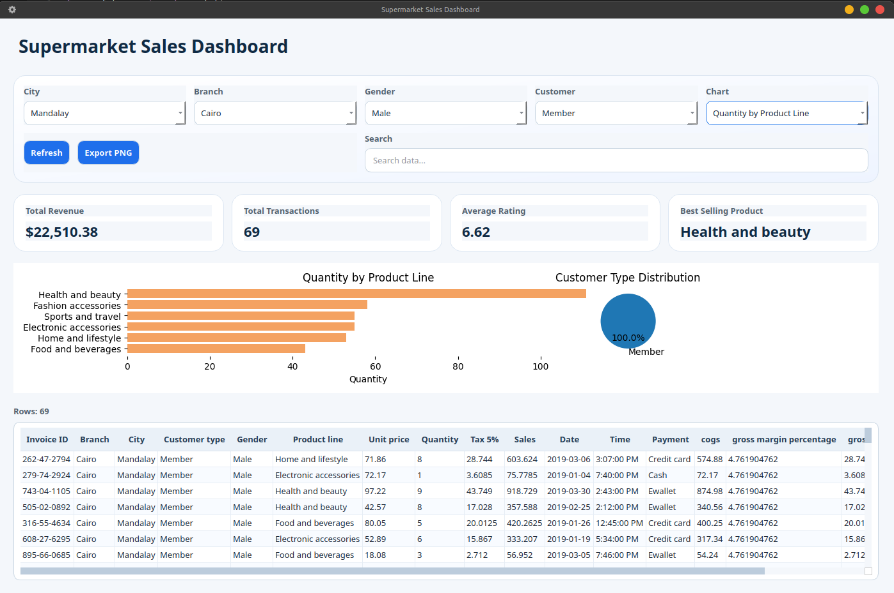
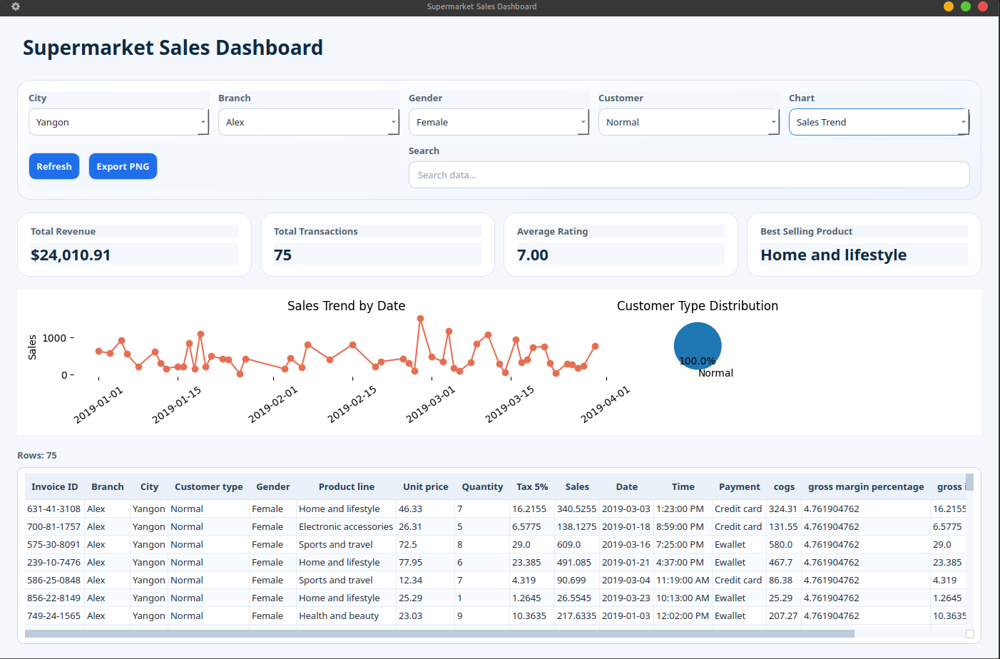

# Dashboard Analisis Supermarket Sales

Project ini merupakan aplikasi desktop Python berbasis PySide6 untuk menampilkan dashboard analisis interaktif dari dataset penjualan supermarket. Aplikasi memuat data CSV, menampilkan raw dataset di tabel, menyediakan filter interaktif, ringkasan KPI, chart yang dapat berganti sesuai dengan filter, serta fitur ekspor chart ke PNG.

## Dataset Source

Sumber dataset Kaggle:
https://www.kaggle.com/datasets/aungpyaeap/supermarket-sales

File yang digunakan pada project ini berada di:
`data/supermarket_sales.csv`

## Penjelasan Dataset

Dataset berisi transaksi penjualan supermarket dengan kolom utama seperti:

- `Invoice ID`: ID unik transaksi
- `Branch`: Cabang toko
- `City`: Kota
- `Customer type`: Jenis pelanggan
- `Gender`: Gender pelanggan
- `Product line`: Kategori produk
- `Unit price`: Harga satuan
- `Quantity`: Jumlah item
- `Tax 5%`: Pajak
- `Sales`: Nilai penjualan
- `Date`: Tanggal transaksi
- `Time`: Waktu transaksi
- `Payment`: Metode pembayaran
- `cogs`: Cost of goods sold
- `gross income`: Pendapatan kotor
- `Rating`: Rating pelanggan

Dataset ini juga memuat kolom tambahan `gross margin percentage`.

## Fitur

- Tabel raw dataset dengan scrolling dan sorting
- Filter interaktif berdasarkan city, branch, gender, dan customer type
- Search bar untuk pencarian data
- Dashboard cards untuk KPI utama
- Embedded bar chart, pie chart, line chart, dan horizontal bar chart
- Tombol refresh untuk reset filter dan reload data
- Export chart ke file PNG
- Error handling menggunakan `QMessageBox`
- Modern UI styling menggunakan Qt stylesheet

## Cara Install

Pastikan menggunakan Python 3.11 atau lebih baru.

```bash
pip install -r requirements.txt
```

## Cara Run

Jalankan dari folder `dashboard_project`:

```bash
python main.py
```

## Struktur Project

```text
dashboard_project/
├── main.py
├── data/
│   └── supermarket_sales.csv
├── ui/
│   ├── __init__.py
│   ├── main_window.py
│   ├── dashboard_widget.py
│   ├── table_widget.py
│   └── summary_cards.py
├── services/
│   ├── __init__.py
│   ├── data_loader.py
│   ├── analytics.py
│   └── exporter.py
├── assets/
│   └── style.qss
├── requirements.txt
└── README.md
```

## Screenshoot

- 
- 
- 